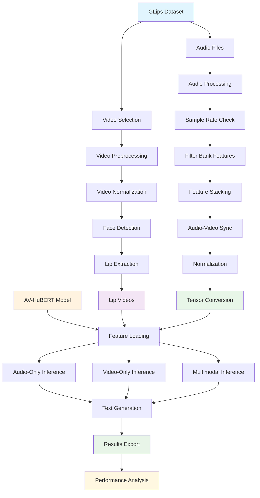

# Lipreading with AV-HuBERT on the GLips Dataset

This repository contains the implementation and results of a Research Workshop project at Tilburg University. The goal of the project is to evaluate the performance of a pretrained **AV-HuBERT** model on the **GLips** dataset, a German lipreading benchmark. The system predicts transcriptions from videos using three modalities:

- 🎧 Audio-only
- 📹 Video-only (silent lipreading)
- 🧠 Audio + Video

The project involves full preprocessing, inference, and results evaluation across thousands of files.

## 🔄 End-to-End Pipeline



---

## 🔧 What the Project Does

- Extracts **lip-only** regions from German speech videos using `dlib`, `OpenCV`, and `ffmpeg`
- Matches each processed video with its original `.wav` audio
- Runs inference using the pretrained [`nguyenvulebinh/AV-HuBERT-MuAViC-de`](https://huggingface.co/nguyenvulebinh/AV-HuBERT-MuAViC-de) model
- Generates predictions from three input types:
  - **Audio-only** (with dummy black video)
  - **Video-only** (with dummy audio)
  - **Audio + Video** (full multimodal inference)
- Saves the predictions into a CSV file for later analysis

---

## 📁 Directory Structure

AV-HuBERT-S2S/

├── video_processed/ # Contains _lip_movement.mp4 videos

├── GLips/lipread_files/ # Original video/audio files per class

├── src/

│ ├── dataset/video_to_audio_lips.py # Lip region extraction pipeline

│ ├── model/avhubert2text.py # Wrapper for AV-HuBERT

│ └── dataset/load_data.py # Load AV model inputs

├── process_lips.py # Select & process 10 test videos per class

├── inference.py # Run AV-HuBERT inference for all samples

├── inference_results.csv # Final decoded predictions

└── model-bin/ # Local cache for Hugging Face + shape_predictor

---

## 🚀 How to Run

### 1. Install Requirements

```bash
conda create -n avhubert python=3.10
conda activate avhubert
pip install -r requirements.txt
```
Install ffmpeg, and make sure it's in your system PATH.

2. Download GLips Dataset
Organize it like this:

GLips/lipread_files/{label}/test/
├── aber_0140-0056.mp4
├── aber_0140-0056.wav
...
3. Preprocess Lip Videos
bash
Copy
Edit
python process_lips.py
Copies 10 .mp4 test files per label

Extracts lip-only region

Saves them to video_processed/

4. Run Inference
bash
Copy
Edit
python inference.py
This script:

Matches each *_lip_movement.mp4 file with its .wav

Runs inference for audio, video, and combined input

Saves output predictions to inference_results.csv

🧪 Output Example
filename	audio_only_prediction	video_only_prediction	audio_video_prediction
aber_0140-0056	"Hallo"	"Hallo"	"Hallo"
aber_0197-1458	"Guten"	"Guten"	"Guten"

⚙️ Technologies Used
PyTorch + HuggingFace Transformers

AV-HuBERT: Self-supervised audio-visual speech model

OpenCV, dlib, scikit-image: for face tracking and lip patch extraction

ffmpeg, ffmpy: video/audio processing

ProcessPoolExecutor: for fast parallel preprocessing

📜 Citation
If using this work, cite the original AV-HuBERT paper:

📬 Contact
For academic inquiries or collaborations, feel free to open an issue or reach out to the author.
